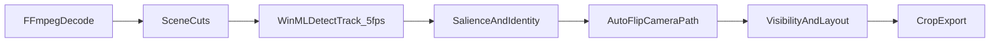

<table width="100%">
  <tr>
    <td align="left" width="120">
      
    </td>
    <td align="right">
      <h1>Open Clipper</h1>
      <h3 style="margin-top: -10px;">AI-powered video clipping and publishing by <a href="https://grepcut.com/">GrepCut</a>.</h3>
    </td>
  </tr>
</table>

[](https://grepcut.com/)
[](https://discord.gg/2uXgrUpe)
[](https://x.com/GrepCut)
[](https://www.linkedin.com/in/adam-zi%C3%B3%C5%82ko-9b6603351/)
[](LICENSE)

## Prerequisites

Windows is the primary development target today.

- [Node.js](https://nodejs.org/)
- [Rust](https://www.rust-lang.org/tools/install) **≥ 1.91**
- [Visual Studio 2022](https://visualstudio.microsoft.com/) or [Microsoft C++ Build Tools](https://visualstudio.microsoft.com/visual-cpp-build-tools/) with the **Windows 10 SDK**
- [WebView2](https://developer.microsoft.com/microsoft-edge/webview2/) (required by Tauri 2 on Windows)
- Static **FFmpeg** via [vcpkg](https://vcpkg.io/) (`x64-windows-static`). The repo expects paths in [`src-tauri/.cargo/config.toml`](src-tauri/.cargo/config.toml) — adjust `VCPKG_ROOT`, `FFMPEG_DIR`, and the MSVC `linker` path for your machine.

## Development

```bash
npm install
npm run tauri:dev
```

`tauri:dev` starts Vite on `http://localhost:1420` via `beforeDevCommand`. Close any running `open-clipper.exe` before rebuilding to avoid file locks.

## Build

| Goal | Command | Output |
|------|---------|--------|
| Fast release EXE (no installer) | `npm run tauri:build:fast` | `src-tauri/target-fast/release/open-clipper.exe` |
| Fast build + launch | `npm run tauri:build:preview:fast` | same EXE, then starts it |
| Full build with installers | `npm run tauri:build` | `src-tauri/target/release/` + bundles |
| Launch existing EXE only | `npm run tauri:preview` | `src-tauri/target/release/open-clipper.exe` |
| Launch existing fast EXE | `npm run tauri:preview:fast` | `src-tauri/target-fast/release/open-clipper.exe` |

`tauri:build:fast` uses lighter Cargo flags (`LTO=off`, `opt-level=2`) and a separate `target-fast/` cache. Production builds run `beforeBuildCommand` (`build:tauri` + MCP staging); models from `public/models` are not copied into `dist` — the app downloads them on demand into AppData.

## Faster builds on Windows

You can optionally exclude the Open Clipper Cargo caches from Windows Defender. Run **PowerShell as administrator** from the project root:

```powershell
$target = (Resolve-Path .\src-tauri\target).Path
Add-MpPreference -ExclusionPath $target
(Get-MpPreference).ExclusionPath -contains $target

$targetFast = Join-Path (Resolve-Path .\src-tauri).Path "target-fast"
if (Test-Path $targetFast) {
  Add-MpPreference -ExclusionPath $targetFast
}
```

To undo:

```powershell
$target = (Resolve-Path .\src-tauri\target).Path
Remove-MpPreference -ExclusionPath $target

$targetFast = Join-Path (Resolve-Path .\src-tauri).Path "target-fast"
if (Test-Path $targetFast) {
  Remove-MpPreference -ExclusionPath $targetFast
}
```

## MCP

Open Clipper exposes local project data to AI agents over two transports (no login):

| Transport | When it works | Endpoint |
|-----------|---------------|----------|
| **HTTP** | Desktop app is running | `http://127.0.0.1:12742/mcp` (override with `OPEN_CLIPPER_MCP_PORT`) |
| **Stdio** | Separate `open-clipper-mcp` process, no GUI | Full path to the staged binary (preferred in Cursor) |

Both transports read the same SQLite database (`%APPDATA%\com.openclipper.app\clipper.sqlite3`, or `OPEN_CLIPPER_DB_PATH`).

**Clip picking (Preview → Generate with LLM):** `list_projects` → `get_project_transcript` → `patch_ai_clips` (word indices). The tab is MCP-only — no in-app chat — and refreshes within ~0.5s when clips are written.

**Export metadata:** `list_exports` → `get_export_details` → `patch_export_social_metadata`

**Cursor setup:** Prefer stdio over the HTTP URL — it avoids OAuth/`mcp_auth` gating. The **MCP** tab in the app copies a ready-made JSON snippet with the correct binary path.

**Build the stdio binary:**

```bash
node scripts/stage-open-clipper-mcp.mjs
```

This runs automatically during `tauri:build` and `tauri:build:fast` (via `beforeBuildCommand`), but **not** during `tauri:dev`. Output: `src-tauri/bin/open-clipper-mcp-<triple>.exe`.

## Stack

| Layer | Version |
|-------|---------|
| Tauri | 2.x |
| React | 19.x |
| Vite | 7.x |
| TypeScript | 5.8.x |

Bundle identifier: `com.openclipper.app`

## Reframe engine

The reframe engine converts source footage into per-format smart crops (e.g. 9:16). It is a modernized port of Google [AutoFlip](https://github.com/google/mediapipe/tree/master/mediapipe/examples/desktop/autoflip): shot boundaries, salient keyframes, and a polynomial/kinematic camera path that keeps a cover-sized crop window on required subjects instead of silently discarding them.

Analyzer version: `autoflip-v43-snap-layout-on-cut`. Vision bundle: `clipper-vision-v5-yolox-s-scrfd10g-tiled`.

### Two-tier pipeline

**Native (Windows)** — FFmpeg decode and WinML/DirectML inference in [`src-tauri/src/video/smart_crop/`](src-tauri/src/video/smart_crop/), started via `start_clipper_winml_analysis`:

- Shot boundaries on every decoded frame (histogram + frame-diff)
- Detectors at **5 FPS** (200 ms cadence): SCRFD faces, YOLOX objects, MoveNet pose fallback
- **ByteTrack v2** on three streams (person / face / pose); trackers reset on scene cuts
- Cheap motion-grid saliency on every detection sample (no model)

**TypeScript graph** — [`src/features/clipper/engine/autoflip/`](src/features/clipper/engine/autoflip) (`buildAutoFlipTrack`):

- Canonical identity fusion, composition memory, importance timeline
- Per-format camera path (polynomial or kinematic, scene-split)
- Visibility controller + layout arbiter → compact `layoutTracks` for preview and export



### Models

Production models ship in [`src-tauri/resources/models/clipper-vision/`](src-tauri/resources/models/clipper-vision/) (see **Models** below for sync/CDN).

| Model | Role |
|-------|------|
| YOLOX-S | Person/object boxes; tiled recovery on long edge |
| SCRFD-10G | Face boxes + 5 keypoints; tiled recovery |
| MoveNet MultiPose | Pose fallback; injects person boxes when YOLOX misses |
| ByteTrack v2 | Stable `trackId` per stream; reset on scene cuts |

Saliency also uses a cheap motion-grid on every detection sample (no model). 

### Identity and composition

- `trackId` — ByteTrack trajectory on native detections
- `canonicalId` — scene-local fusion of person + face + pose (Hungarian assignment)
- `projectIdentityId` — clip-wide entity after full-clip observation (IoU association)

YOLOX person boxes enter composition memory only when corroborated by a face or pose (avoids graphics/mannequins). Composition memory biases salience across the clip without persisting biometric embeddings.

### Camera path

Scenes come from native `sceneCuts`; long scenes are chunked. Steady motion uses a polynomial path solver; tracking motion uses a kinematic solver (both ported from AutoFlip). The cover-crop window moves to keep required subjects visible rather than silently discarding them — min zoom scale `0.65`, and scenes shorter than 8 s avoid aggressive zoom (1 s when source aspect already matches the target). Tracks are stored at 5 Hz; the renderer interpolates between samples.

### Visibility and layout

Per-format layout modes: `single-crop`, `split` (2–3 panels), or `contain` (letterbox padding). Split layouts apply only to portrait/square targets — 16:9 never splits.

A visibility controller plans single vs split crops with a rescue ladder (shifted crop, wider crop, emergency primary, stable split). An arbiter chooses between that semantic plan and a legacy `aspectTracks` baseline. Preview and export read compact `layoutTracks` keyed by aspect id (`9-16`, `16-9`, `1-1`, `4-5`); the full analysis blob keeps diagnostics and arbitration scores.

### Code map

| Area | Path |
|------|------|
| Native pipeline | [`src-tauri/src/video/smart_crop/`](src-tauri/src/video/smart_crop/) |
| Tauri command | `start_clipper_winml_analysis` in [`src-tauri/src/commands/clipper/video.rs`](src-tauri/src/commands/clipper/video.rs) |
| AutoFlip graph | [`src/features/clipper/engine/autoflip/build-track.util.ts`](src/features/clipper/engine/autoflip/build-track.util.ts) |
| Pipeline stages | [`analyze-faces.util.ts`](src/features/clipper/pipeline/stages/analyze-faces.util.ts), [`analyze-subjects.util.ts`](src/features/clipper/pipeline/stages/analyze-subjects.util.ts) |
| Types and output | [`src/features/clipper/shared/smart-crop.util.ts`](src/features/clipper/shared/smart-crop.util.ts) |

Headless benchmarks (`--benchmark-run`) evaluate reframe quality via focus-hit metrics and optional miss-frame export.

## Models

ASR models (Parakeet, Whisper) download on first use into `%APPDATA%\com.openclipper.app\models\`. For local dev without CDN, place files under `public/models/<model-id>/` (see per-model READMEs there).

WinML vision models ship in `src-tauri/resources/models/clipper-vision/`.

CDN publishing workflow: [`models_automation/README.md`](models_automation/README.md).

## DirectML (Windows GPU)

On Windows, most local ML runs on GPU through DirectML: WinML vision (reframe), ASR (Parakeet and Whisper via sherpa-onnx), and optional MDX vocals isolation. Vision models use the system WinML/DirectML stack; no extra build is required for those.

ASR (Parakeet / Whisper) needs a DirectML-enabled `sherpa-onnx` build. Stock prebuilt libs are CPU-only. Debug builds prefer ONNX under `public/models/<model-id>/` when present; production uses the AppData cache (or `PARAKEET_MODEL_DIR` / `SHERPA_ONNX_MODEL_DIR`).

To enable GPU ASR:

1. Install **Visual Studio 2022** with the **Windows 10 SDK**, plus **CMake** and **Git**
2. Build native libs (one-time, ~15–30 min):

```bash
npm run sherpa:directml
```

3. Rebuild the app so Cargo links the custom libs:

```bash
cd src-tauri && cargo clean && cd ..
npm run tauri:dev
```

`npm run sherpa:directml` writes `SHERPA_ONNX_LIB_DIR` to [`src-tauri/.cargo/config.toml`](src-tauri/.cargo/config.toml) pointing at `third_party/sherpa-onnx-directml/install/lib`.

## Contributing

Questions, bug reports, and feature ideas are welcome. [Join the Discord](https://discord.gg/2uXgrUpe) or [open an issue](https://github.com/GrepCut/OpenClipper/issues). Please follow our [Code of Conduct](.github/CODE_OF_CONDUCT.md).

## License

[MIT](LICENSE) — Copyright 2026 GrepCut
