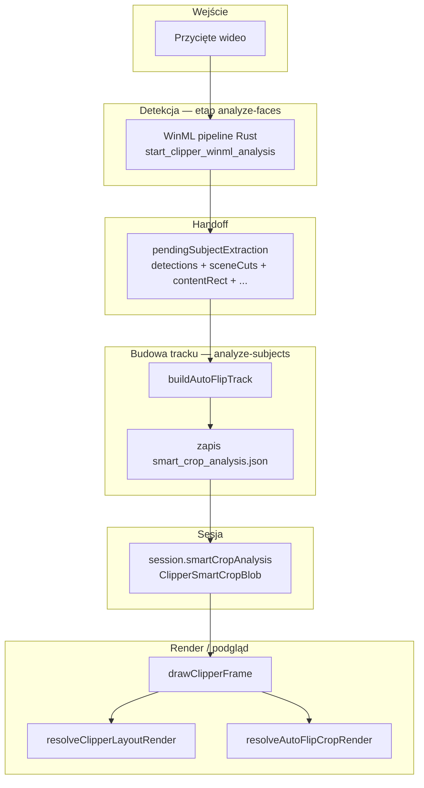
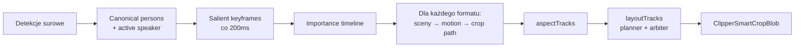

# Smart Crop — architektura i flow danych

Ten dokument opisuje, jak działa **Smart Crop** (w UI: tryb **Smart Follow**) w Open Clipper: skąd biorą się dane, jak są przetwarzane i jak trafiają do podglądu oraz renderu.

---

## Co to jest Smart Crop?

Smart Crop to automatyczne kadrowanie wideo pod wybrane formaty (np. TikTok 9:16, Instagram 1:1). Zamiast statycznego centrowania klipu, system:

1. **Analizuje wideo** — wykrywa twarze, osoby, pozy, ruch kamery, cięcia scen.
2. **Buduje ścieżkę kamery** — dla każdego formatu wyjściowego oblicza prostokąt kadru (`crop`) w znormalizowanych współrzędnych źródła (0–1).
3. **Decyduje o układzie** — pojedynczy kadr, split-screen lub tryb contain z paddingiem.
4. **Renderuje** — wycina odpowiedni fragment klatki i skaluje do rozdzielczości docelowej.

Wynik analizy jest zapisywany na dysku jako `smart_crop_analysis.json` i trzymany w sesji jako `session.smartCropAnalysis`.

---

## Gdzie to się włącza w pipeline

Smart Crop nie działa w izolacji — jest częścią szerszego pipeline’u przygotowania podglądu:

```
Trim wideo → Segmentacja klipów → Analiza twarzy → Analiza obiektów (Smart Crop) → Podgląd / render
```

| Etap | Plik | Co robi dla Smart Crop |
|------|------|------------------------|
| Trim | `pipeline/stages/trim.ts` | Przygotowuje przycięty plik wideo (zakres źródłowy) |
| Faces | `pipeline/stages/analyze-faces.ts` | Dekoduje klatki, wykrywa twarze **i** uruchamia ekstrakcję obiektów |
| Subjects | `pipeline/stages/analyze-subjects.ts` | Czeka na detekcje, buduje track AutoFlip, zapisuje blob |
| Preview/render | `engine/frame-draw.ts` | Interpoluje crop/layout w czasie `t` i rysuje klatkę |

Etap twarzy i obiektów jest **współdzielony**: jeden przejazd WinML (desktop Windows) dostarcza dane do obu etapów. Handoff między nimi odbywa się przez `session.pendingSubjectExtraction`.

---

## Diagram: end-to-end flow



---

## Silnik detekcji: WinML (desktop Windows)

- Komenda Tauri: `start_clipper_winml_analysis`
- Implementacja Rust: `src-tauri/src/video_processing/winml_pipeline.rs`, `winml_vision.rs`
- Jedna atomowa operacja: dekodowanie + inferencja twarzy (BlazeFace) + obiektów (YOLOX) + pozy + ByteTrack + analiza tła/letterboxa
- Zwraca gotową tablicę `subjectSamples` oraz face samples do cache

| Pole handoffu | Znaczenie |
|---------------|-----------|
| `detections` | Próbki detekcji per timestamp (WinML) |
| `sceneCutTimestamps` | Granice ujęć (cięcia scen) |
| `contentRect` | Aktywny obszar obrazu po usunięciu czarnych pasów |
| `staticFeatureSamples` | Czy tło jest jednolite (slajdy, gameplay) |
| `importanceSignals` | Opcjonalne sygnały: saliency, motion, active-speaker |
| `trackerVersion` | Np. `bytetrack-v1` — stabilne ID obiektów w czasie |
| `engine` | Zawsze `"winml"` |

---

## Główna struktura danych: `ClipperSmartCropBlob`

Definicja: `src/features/clipper/shared/smart-crop.ts`

Blob to **zserializowany wynik całej analizy Smart Crop**. Warstwy:

### Warstwa 1 — `aspectTracks` (lossless crop)

```ts
aspectTracks[formatId] = {
  targetAspectRatio,
  samples: AutoFlipCropSample[]  // { t, crop: NormalizedBox, cut?, solidBackgroundColor? }
}
```

- **Jeden niezależny tor kamery na każdy format crop** (TikTok, Instagram, …)
- `crop` to pełny prostokąt w przestrzeni źródła — zachowuje skalę okna (nie tylko punkt środkowy)
- To jest ścieżka **Run 4 / AutoFlip baseline** (śledzenie ruchu kamery po salient regions)

### Warstwa 2 — `importanceSamples` (semantyka)

```ts
ImportanceRegionSample { time, regions: ImportanceRegion[], cut? }
```

- Regiony ważności: twarz, głowa, mówca, osoba, akcja, ekran, obiekt
- Każdy region ma `box`, szerszy `contentBox`, `importanceScore`, `role` (primary/secondary)
- Powstają z keyframe’ów salient + rankingu (`importance-ranker.ts`)

### Warstwa 3 — `layoutTracks` (decyzje montażowe)

```ts
ClipperLayoutSample {
  t, mode: "single-crop" | "split" | "contain",
  viewports: NormalizedBox[],
  strategy?, reasonCodes?, ...
}
```

- **To jest to, co faktycznie wybiera renderer** w trybie Smart Follow (gdy layout jest dostępny)
- `layout-planner.ts` łączy baseline AutoFlip z propozycjami semantycznymi
- `layout-arbiter.ts` wybiera zwycięzcę (baseline vs semantic) wg progów stabilności i pokrycia

### Metadane

| Pole | Opis |
|------|------|
| `analyzerVersion` | Wersja algorytmu — invaliduje cache przy zmianie |
| `contentRect` | Letterbox/pillarbox — współrzędne aktywnego obrazu |
| `canonicalIdentityTelemetry` | Statystyki fuzji tożsamości (osoba + twarz + poza) |

Persistencja: `grepcut/projects/{projectId}/data/smart_crop_analysis.json`

---

## `buildAutoFlipTrack` — serce przetwarzania

Plik: `src/features/clipper/engine/autoflip/build-autoflip-track.ts`

Funkcja `buildAutoFlipTrack(input)` zamienia surowe detekcje w kompletny blob. Kolejność kroków:



### Krok po kroku

1. **Normalizacja przestrzeni** — `contentRect` mapuje detekcje do aktywnego obsahu (bez czarnych pasów).

2. **Tożsamość** — `canonical-person.ts` łączy person/face/pose w `canonicalId`; `active-speaker.ts` dodaje sygnał mówcy (LR-ASD).

3. **Salient keyframes** — `salient-region.ts` co ~200 ms buduje regiony z twarzy, poz, detekcji YOLOX, z wagami sygnałów (face_core, human, motion, …).

4. **Importance ranking** — `importance-ranker.ts` klastruje regiony, nadaje role i wynik ważności.

5. **Podział na sceny** — `sceneCuts` + limit `AUTOFLIP_MAX_SCENE_FRAMES`; długie sceny są dzielone.

6. **Per-scena, per-format:**
   - Jeśli **jednolite tło + brak foreground** → padding (cały `contentRect`, kolor tła)
   - W przeciwnym razie: `analyzeSceneMotion` → `cropScenePath` (kinematyka / wielomian)
   - `expandCropAcrossBars` — rozszerza crop na pasy letterboxa, zachowując minimalny cover crop

7. **Layout** — `buildLayoutTracks()`:
   - Propozycja **baseline** z `aspectTracks`
   - Propozycja **semantic** z `importanceSamples` (single / split / contain)
   - **Arbiter** wybiera zwycięzcę; visibility controller ratuje przypadki utraty obiektu

---

## Co widzi użytkownik: render klatki

Plik: `src/features/clipper/engine/frame-draw.ts`, funkcja `drawClipperFrame()`

Gdy `reframe.cropMode === "smart-follow"` i format ma `mode === "crop"`:

```
1. resolveClipperLayoutRender(blob, formatId, source, t)
   → jeśli jest layout (split/single/contain) → drawClipperLayoutFrame()

2. w przeciwnym razie: collage dwóch mówców (face pipeline, osobna ścieżka)

3. w przeciwnym razie: resolveAutoFlipCropRender() → drawClipperPlatformFrame()
   → interpolacja crop między próbkami; przy cut nie interpoluje (skok ujęcia)
```

**Priorytet renderu w Smart Follow:**

| Priorytet | Źródło | Efekt |
|-----------|--------|-------|
| 1 | `layoutTracks` (split) | Dwa viewporty, podcast layout |
| 2 | Collage (face) | Split oparty na twarzach, gdy użytkownik nie wyłączył regionu |
| 3 | `aspectTracks` | Klasyczny AutoFlip crop |

Interpolacja czasu: `interpolateAutoFlipCrop()` — liniowa na `x, y, width, height`; przy `cut: true` trzyma poprzedni kadr (brak sztucznego pana między ujęciami).

Padding: gdy proporcje crop ≠ proporcje wyjścia, renderer używa rozmytego tła lub `solidBackgroundColor` ze sceny (slajdy).

---

## Mapa modułów AutoFlip

| Moduł | Odpowiedzialność |
|-------|------------------|
| `salient-region.ts` | Keyframe’y co 200 ms, sygnały salient z detekcji |
| `scene-camera-motion.ts` | Typ ruchu sceny (tracking / static / padding) |
| `scene-cropper.ts` | Ścieżka crop w czasie (kinematyka One Euro / wielomian) |
| `importance-ranker.ts` | Regiony ważności, klastrowanie, role |
| `layout-planner.ts` | Propozycje single/split/contain + semantic framing |
| `layout-arbiter.ts` | Wybór baseline vs semantic, progi stabilności |
| `visibility-controller.ts` | Ratowanie widoczności wymaganych regionów |
| `canonical-person.ts` | Fuzja person + face + pose |
| `active-speaker.ts` | Polityka active speaker (ASD) |
| `shot-crop-smoothing.ts` | Wygładzanie crop na granicach ujęć |

---

## Sesja i cache

Plik: `src/features/clipper/pipeline/session.ts`

| Pole sesji | Rola |
|------------|------|
| `smartCropAnalysis` | Aktualny blob analizy |
| `collageFaceSamples` | Twarze wzbogacone o głowy z detektora person |
| `faceRenderCache` | Osobna ścieżka collage / single-focus (twarze) |
| `pendingSubjectExtraction` | Tymczasowy bufor między etapami faces → subjects |

`buildFrameContext()` składa kontekst renderu: ustawienia, napisy, twarze, smart crop.

---

## Tryby crop w ustawieniach reframe

| `cropMode` | Zachowanie |
|------------|------------|
| `smart-follow` | Używa `smartCropAnalysis` (layout + AutoFlip) |
| `face-pick` / inne | Śledzenie twarzy z `faceCache`, bez Smart Crop blob |
| `manual` | Ręczne kadrowanie użytkownika |

Smart Crop **wymaga** udanego etapu `analyze_subjects` na desktopie Windows (WinML). Bez natywnej ścieżki blob może być `null` z `degradedReason`.

---

## Benchmark i replay

Narzędzia w `src/features/tests/benchmark/` konsumują ten sam blob:

- `run-analysis.ts` — headless analiza datasetów testowych
- `replay/replay-engine.ts` — deterministyczny replay decyzji layout z zapisanych artefaktów
- Metryki: focus hit, coverage, cohort stats

To pozwala kalibrować parametry arbitra (`layout-arbiter.ts`) offline, zanim trafią do produkcji.

---

## Wersjonowanie i invalidacja cache

Analiza jest ważna tylko gdy:

- `clipStart` / `clipEnd` zgadzają się z aktualnym zakresem klipu
- `analyzerVersion` === `AUTOFLIP_ANALYZER_VERSION` (z `autoflip/types.ts`)

Przy `skipSubjectAnalysis: true` pipeline próbuje wczytać zapisany JSON z dysku (`readClipperSmartCropAnalysis`).

---

## Podsumowanie jednym zdaniem

**Smart Crop = detekcja obiektów/twarzy/poz na wideo → AutoFlip buduje ścieżkę kamery per format → planner/arbiter wybiera najlepszy układ → renderer interpoluje crop/layout w czasie rzeczywistym i zapisuje wynik w `smart_crop_analysis.json`.**

---

## Kluczowe pliki (ścieżki względem repo)

```
src/features/clipper/
├── shared/smart-crop.ts              # typy i ClipperSmartCropBlob
├── engine/frame-draw.ts              # render klatki (layout + crop)
├── engine/autoflip/build-autoflip-track.ts  # główny pipeline AutoFlip
├── pipeline/stages/analyze-faces.ts  # WinML analiza + handoff
├── pipeline/stages/analyze-subjects.ts       # budowa i zapis blob
├── pipeline/session.ts               # sesja i cache
└── persistence/project-data-files.ts # smart_crop_analysis.json

src-tauri/src/video_processing/
├── winml_pipeline.rs                 # natywna analiza WinML
└── winml_vision.rs                   # modele ONNX
```
